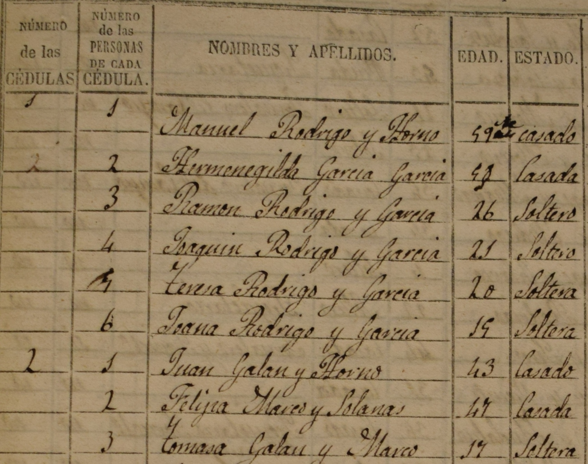

::: {style="text-align: center;"}

::: {.term-row}
[Programme]{.term-left} [Workshop]{.term-right}
:::

---

### What was in a name? Culture, naming practices and individual outcomes in the past 

**Trondheim, October 12-13, 2026**

Venue: [Akrinn](https://maps.app.goo.gl/neGSMmi15nzrfNyr5) (Sverres gate 12) - Room U202

:::

---

**Monday, October 12^th^**

---

[09:30]{.dt-time-break} [&nbsp;&nbsp;&nbsp;&nbsp;&nbsp;&nbsp;&nbsp;&nbsp;**--- Welcome ---**]{.dt-title-break}

[09:45]{.dt-time} **Naming and work in the Venetian Pre-Alps, 1573–1782**

: Francesco Fiore Melacrinis (University of Milan-Bicocca)

[10:30]{.dt-time} **Saint's-day naming as a measure of religiosity: France, 1801–1859**

: Nick Fitzhenry (Aix-Marseille School of Economics), Cécilia García-Peñalosa (Aix-Marseille School of Economics) and Alberto Soto Aladro (Aix-Marseille School of Economics)

::: {style="text-align: center;"}
***--- Coffee break ---*** 
:::

[11:30]{.dt-time} **Two centuries of first names in northern Sweden: Kin, ethnicity, church, calendar and fashion, 1700-1900**

: Erling Häggström Gunfridsson and Ritu Andersson	

::: {style="text-align: center;"}
***--- Lunch ---*** 
:::

[13:15]{.dt-time} **Political selection and the quality of institutions: Elite and gender gaps**

: Rebeca Echavarri (Public University of Navarra)	

[14:00]{.dt-time} **Naming the Nation: Cultural Change, Kinship and Family Strategies in Greece, c. 1830–1920**

: Eftychia Kalaitzidou (Norwegian University of Science and Technology)

::: {style="text-align: center;"}
***--- Coffee break ---*** 
:::

[15:00]{.dt-time} **Naming and social mobility in Southern Europe (the area of Barcelona, 16th-19th centuries)**

: Gabriel Brea Martínez (Open University of Catalonia) and Joana M. Pujadas Mora (Open University of Catalonia)

[15:45]{.dt-time} **TBA**

: Lars H. Andersen (Norwegian University of Science and Technology)	 

[17:00]{.dt-time-break} [&nbsp;&nbsp;&nbsp;&nbsp;&nbsp;&nbsp;&nbsp;&nbsp;&nbsp;&nbsp;***--- City walk ---***]{.dt-title-break}

[18:30]{.dt-time-break} [&nbsp;&nbsp;&nbsp;&nbsp;&nbsp;&nbsp;&nbsp;&nbsp;&nbsp;&nbsp;&nbsp;&nbsp;&nbsp;***--- Dinner ---***]{.dt-title-break}
<!-- ([To Rom og Kjøkken](https://maps.app.goo.gl/zJosBWw33q1dNeGM7), Karl Johan Gate 5) -->

---

**Tuesday, October 13^th^**

---

[09:00]{.dt-time} **The Onomastic Revolution: Using naming practices as a lens on neonatal mortality**

: Alessandra Minnello (University of Padova)

[09:30]{.dt-time} **Industrialization and cultural values in China: Evidence from the 156 projects**

: Yuting Chen	(University of British Columbia)

[10:15]{.dt-time} **Land access and name changes within Sámi communities, 1900-1910**

: Ida Stallvik (Norwegian University of Science and Technology)

::: {style="text-align: center;"}
***--- Coffee break ---*** 
:::

[11:15]{.dt-time} **Social status and first names in England, 1780-2026**

: Christian Alexander Abildgaard Nielsen (University of Southern Denmark), Gregory Clark (University of Southern Denmark) and Matthew Curtis (University of Southern Denmark)

::: {style="text-align: center;"}
***--- Lunch ---*** 
:::

[13:00]{.dt-time} **What was in a grandfather's name?**

: Gunnar Thorvaldsen (University of Tromsø) and Gulbrand Alhaug	(University of Tromsø)

[13:45]{.dt-time} **The practice of giving names in Russian Orthodox culture: the problems of choice**

: Alexandre Avdeev and Irina Troitskaya	

::: {style="text-align: center;"}
***--- Coffee break ---*** 
:::
	
[14:45]{.dt-time} **In the name of kings: Nationalism and education in early-20th century Norway**

: Francisco J. Beltrán Tapia (Norwegian University of Science and Technology)	

::: {style="text-align: center;"}
***--- Quizz ---*** 
:::

[18:00]{.dt-time-break} [&nbsp;&nbsp;&nbsp;&nbsp;&nbsp;**--- Farewell Dinner ---**]{.dt-title-break}

<!-- [Kalas og Canasta](https://maps.app.goo.gl/oefSDsp1evjcDSFr8), Nedre Bakklandet 5 --> 

---

::: {layout-ncol=3 .equal-height-images}

:::