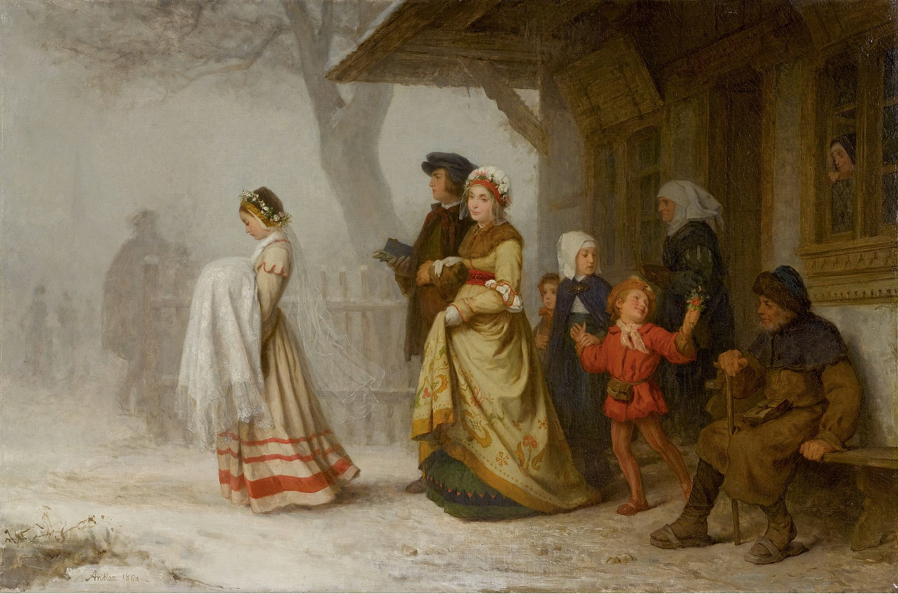
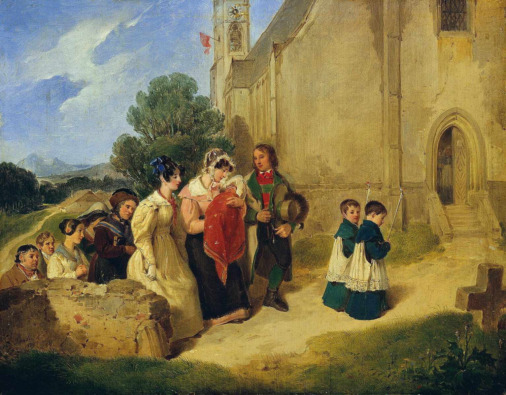

::: {style="text-align: center;"}

### Workshop

---

### What was in a name? Culture, naming practices and individual outcomes in the past 

**Trondheim, October 12-13, 2026**

:::

**Call for Papers**

::: {.grid}

::: {.g-col-9}

Naming practices reflect the cultural context underpinning a particular society, thus offering a unique opportunity to study cultural variation, persistence and change. Likewise, given that first names provide crucial insights about parental values and beliefs, they can shed light on how cultural factors may have influenced the way parents raised their children (e.g. the care they devoted to their children, the importance they attached to education, their political views, etc.). 

This workshop therefore invites contributions studying the information contained in first names from a historical perspective. In particular, we seek contributions (1) tracing changes in naming practices over time or in response to particular events; (2) analysing the dimensions that explain the variation in naming practices, not only across regions and over time, but also between families; and (3) exploring how parental cultural values, captured through names, may influence their children outcomes, in terms of health, education, marriage behaviour, politics, etc. Related topics are also welcome.

Hosted at the Department of Historical Studies at the Norwegian University of Science and Technology, this interdisciplinary workshop aims to bring together historians, economists, demographers and other social scientists working on these issues from a historical perspective. If you are interested in presenting your work, please contact Lars Harhoff Andersen ([lars.h.andersen@ntnu.no](mailto:lars.h.andersen@ntnu.no)) or Francisco J. Beltrán Tapia ([francisco.beltran.tapia@ntnu.no](mailto:francisco.beltran.tapia@ntnu.no)). A paper proposal (up to 500 words) should be submitted before September 10^st^. Accepted contributions will be notified by Sept 15^th^.

There is no participation fee and lunch, refreshments and dinner will be provided during the workshop. Participants are expected to cover their own travel and accommodation expenses. 
:::

::: {.g-col-3}
 

:::

:::

